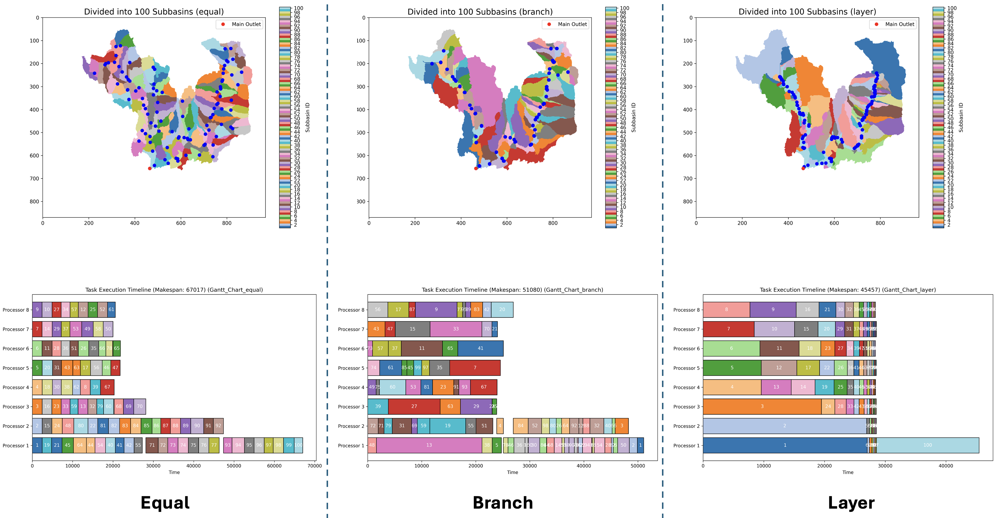

# Task-Based Watershed Subdivision and Simulation

This repository provides tools for subdividing watersheds into subbasins and optimizing task execution for hydrological modeling. The implementation leverages `pysheds`, `numpy`, and `matplotlib` for processing raster data and visualization.

## Features

- **Divide Watersheds**: Subdivide a watershed into subbasins using multiple methods (`layer`, `branch`, and `equal`).
- **Simulate Task Execution**: Simulate task scheduling and execution across multiple processors.
- **Dependency Resolution**: Automatically build dependencies between tasks based on subbasin flow direction.
- **Visualization**: Generate subbasin maps and Gantt charts for task scheduling.

## Installation

1. Install dependencies:
   ```bash
   pip install numpy matplotlib pysheds pyproj
   ```

## Usage

Below is an example of how to use the functions in this repository:

```python
# Example usage
asc_file_path = 'path/to/your/dem.asc'
col, row = 465, 656  # Main outlet coordinates
num_processors =8 # Number of processors
num_subbasins=100 # Divide into 100 subbasins

# Divide the watershed into subbasins
target_points = divide_catchments(
    asc_file=asc_file_path,
    col=col,
    row=row,
    num_processors, 
    num_subbasins,
    method='layer',
    crs="EPSG:26910",
    is_plot=True
)
```

## Functions

### `sort_target_points`
Sorts target points based on branch time and finds the longest branch and the task with the maximum duration.

### `simulate_task_execution`
Simulates task execution across multiple processors and optionally generates a Gantt chart.

### `divide_catchments`
Divides a watershed into subbasins based on flow direction and accumulation.

### `plot_utilization`
Plots a graph showing the relationship between basin numbers, makespan, and average utilization. Useful for visualizing performance under different configurations.

## Methods

### Equal
The `equal` method divides the watershed into subbasins with similar sizes. This method is highly efficient for scenarios with frequent inter-process communication and ensures balanced workloads among processors.

### Branch
The `branch` method hierarchically subdivides the watershed along river branches. It performs well when many processors are available, and the subbasins have medium complexity, utilizing strong CPU computational power.

### Layer
The `layer` method splits the watershed into two layers. The first layer contains independent subbasins, and the second layer depends on the first. This approach is effective when the number of processors is limited, and there are many subbasins, leveraging strong storage capacity.

### Summary
Each method has its strengths:
- **Equal**: Best for real-time inter-process interaction.
- **Branch**: Best when CPU computation capacity is strong.
- **Layer**: Best for scenarios with high storage capacity.

## Visualization

- **Subbasin Map**: Displays the divided subbasins with unique colors.
- **Gantt Chart**: Visualizes task execution schedules across processors.
- **Utilization Plot**: Shows the relationship between basin numbers, makespan, and processor utilization for performance analysis.


